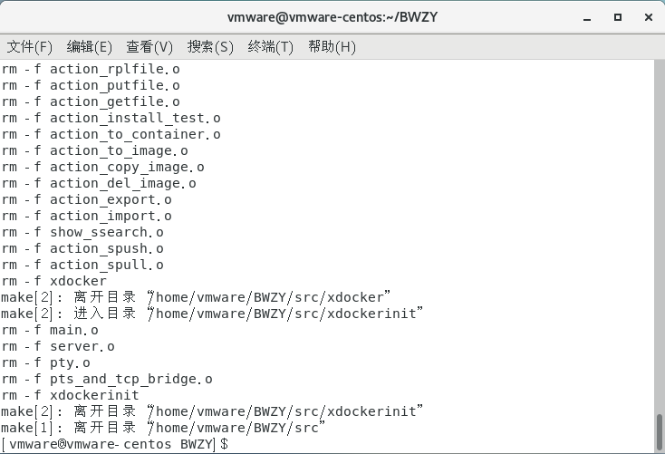
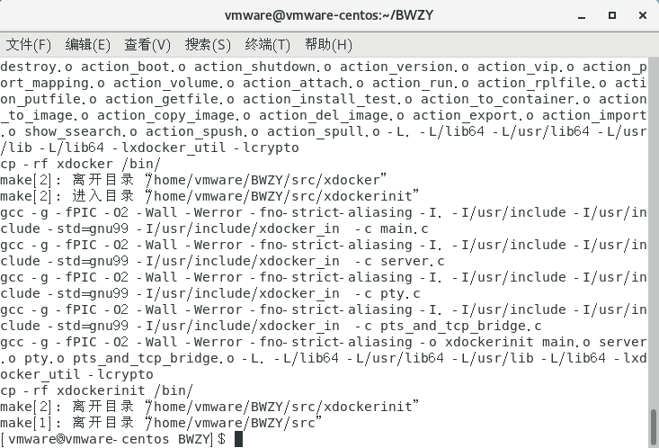
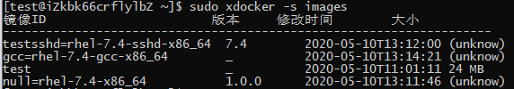

XDocker使用方法

测试服务器地址：39.106.101.172
端口：29
用户名：test
密码：BWZYtest

1、	系统需求
CentOS 7 管理员权限
2、安装
2.1安装依赖
sudo yum install telnet nmap-ncat bridge-utils man-pages supermin5 openssl-devel	
	2.2 开启内核转发
		此步骤需切换至root账户
		echo "net.ipv4.ip_forward=1" >>/etc/sysctl.conf
sysctl -p
 	
	2.3 下载源代码
		git clone https://github.com/YZZZZZ2333/BWZY
		cd BWZY
	
	2.4 编译安装
		sudo make -f makefile.Linux clean
        
		
		sudo make -f makefile.Linux install
        
		若未出现报错信息则为安装成功

3、	使用
输入sudo xdocker可查看简易使用说明
使用方法 : xdocker -v
查询镜像列表：  -s images
查询容器列表：  -s containers
创建容器：      -a create (-m|--image) (image[:version])[,(image[:version])]... [ create options ] [ (-c|--container) (container) ] [ (-b|--boot) [ cgroup options ] [ (-t|--attach) | (-e|--exec) (cmd|"program para1 ...") ] ]
文件内容替换：  -a rplfile (-c|--container) (container) (--template-file) (template_file) (--mapping-file) (mapping_file) [ (--instance-file) (instance_file) ]
开启容器：      -a boot (-c|--container) (container) [ cgroup options ] [ (-t|--attach) | (-e|--exec) (cmd|"program para1 ...") ]
连接到容器：    -a attach (-c|--container) (container)
运行容器命令：  -a run (-c|--container) (container) (--cmd) (cmd)
关闭容器：      -a shutdown (-c|--container) (container) [ (-f|--forcely) ]
强行停止：      -a kill (-c|--container) (container) [ (-f|--forcely) ]
删除容器：      -a destroy (-c|--container) (container) [ (-f|--forcely) ] [ (-h|--shutdown) ]
查询版本：      -a version (-m|--image) (image[:version]) [ --version (version) ]
修改容器IP：    -a vip (-c|--container) (container) --vip (ip)
端口映射：      -a port_mapping (-c|--container) (container) --port-mapping (src_port:dst_port)
分卷管理：      -a volume (-c|--container) (container) --volume (host_path[:container_path])[ ...]
容器转镜像：    -a to_image --from-container (container) [ --verion (verion) ] --to-image (image)
镜像转容器：    -a to_container --from-image (image[:version]) (-m|--image) (image[:version])[,(image[:version])]... [ create options ] --to-container (container)
复制镜像：      -a copy_image --from-image (image[:version]) --to-image (image[:version])
删除镜像：      -a del_image (-m|--image) (image[:version])
导入镜像：      -a import --image-file (file)
导出镜像：      -a export (-m|--image) (image[:version])
搜索镜像：      -s ssearch --srepo (user@host)
安装测试：      -a install_test
create options : [ --volume (host_path:container_path) ][ --volume ... ] [ --host (hostname) ] [ --net (BRIDGE|HOST|CUSTOM) ] [ --host-eth (eth) ] [ --vip (ip) ] [ --port-mapping (src_port:dst_port) ]
cgroup options : [ --cpus [(cpu_num,...)|(cpu_num-cpu_num2)] ] [ --cpu-quota (percent%) ] [ --mem-limit (num|numM) ]
  enable debug : [ (-d|--debug) ]

3.1 安装、运行、停止、卸载测试镜像
# sudo xdocker -a install_test
完成
# sudo xdocker -s images
image_id                       version    modify_datetime     size      
--------------------------------------------------------------------
test                           _          2020-05-10T09:21:12 24 MB
# sudo xdocker -a create -m test -c test
完成
# sudo xdocker -a boot -c test -t   
connect to container ok
--- Welcome to xdocker contrainer ---

[root@test /root] exit
logout
# sudo xdocker -a shutdown -c test
完成
# sudo xdocker -a destroy -c test
完成

3.2 现有可用镜像
    
